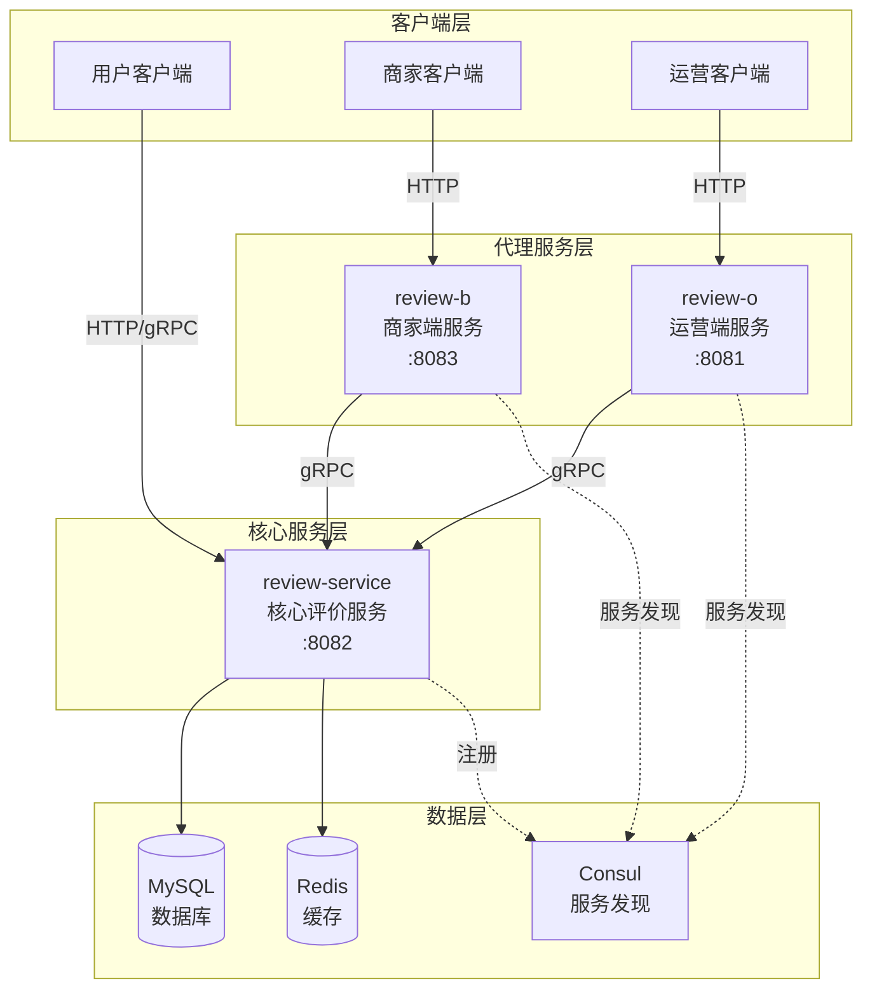
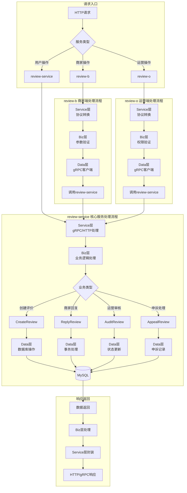
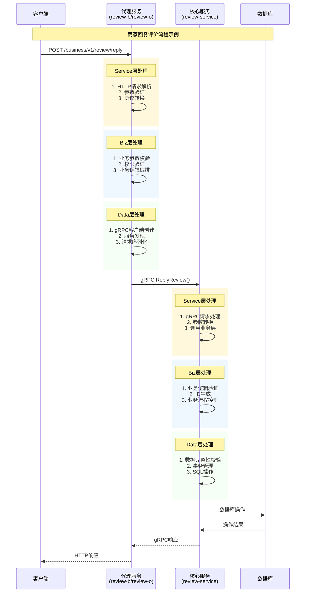
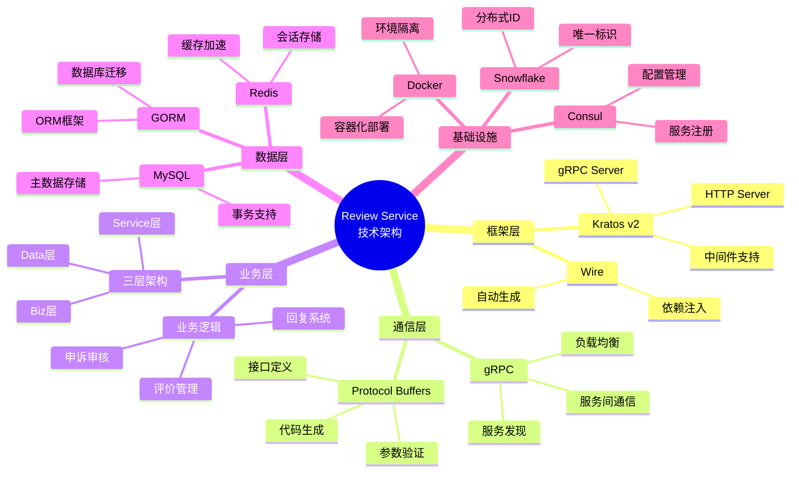

### 整体架构流程图

```mermaid
graph TB
    subgraph "客户端层"
        A[用户客户端] 
        B[商家客户端]
        C[运营客户端]
    end
    
    subgraph "代理服务层"
        D[review-b<br/>商家端服务<br/>:8083]
        E[review-o<br/>运营端服务<br/>:8081]
    end
    
    subgraph "核心服务层"
        F[review-service<br/>核心评价服务<br/>:8082]
    end
    
    subgraph "数据层"
        G[(MySQL<br/>数据库)]
        H[(Redis<br/>缓存)]
        I[Consul<br/>服务发现]
    end
    
    A -->|HTTP/gRPC| F
    B -->|HTTP| D
    C -->|HTTP| E
    D -->|gRPC| F
    E -->|gRPC| F
    F --> G
    F --> H
    D -.->|服务发现| I
    E -.->|服务发现| I
    F -.->|注册| I
```

### 详细代码处理流程

```mermaid
flowchart TD
    subgraph "请求入口"
        A1[HTTP请求] --> A2{服务类型}
        A2 -->|商家操作| B1[review-b]
        A2 -->|运营操作| C1[review-o] 
        A2 -->|用户操作| D1[review-service]
    end
    
    subgraph "review-b 商家端处理流程"
        B1 --> B2[Service层<br/>协议转换]
        B2 --> B3[Biz层<br/>参数验证]
        B3 --> B4[Data层<br/>gRPC客户端]
        B4 --> B5[调用review-service]
    end
    
    subgraph "review-o 运营端处理流程"
        C1 --> C2[Service层<br/>协议转换]
        C2 --> C3[Biz层<br/>权限验证]
        C3 --> C4[Data层<br/>gRPC客户端]
        C4 --> C5[调用review-service]
    end
    
    subgraph "review-service 核心服务处理流程"
        D1 --> D2[Service层<br/>gRPC/HTTP处理]
        B5 --> D2
        C5 --> D2
        D2 --> D3[Biz层<br/>业务逻辑处理]
        D3 --> D4{业务类型}
        D4 -->|创建评价| E1[CreateReview]
        D4 -->|商家回复| E2[ReplyReview]
        D4 -->|运营审核| E3[AuditReview]
        D4 -->|申诉处理| E4[AppealReview]
        
        E1 --> F1[Data层<br/>数据库操作]
        E2 --> F2[Data层<br/>事务处理]
        E3 --> F3[Data层<br/>状态更新]
        E4 --> F4[Data层<br/>申诉记录]
        
        F1 --> G1[(MySQL)]
        F2 --> G1
        F3 --> G1
        F4 --> G1
    end
    
    subgraph "响应返回"
        G1 --> H1[数据返回]
        H1 --> H2[Biz层处理]
        H2 --> H3[Service层封装]
        H3 --> H4[HTTP/gRPC响应]
    end
```

### 分层架构详细流程

```mermaid
sequenceDiagram
    participant Client as 客户端
    participant ProxyService as 代理服务<br/>(review-b/review-o)
    participant CoreService as 核心服务<br/>(review-service)
    participant DB as 数据库
    
    Note over Client,DB: 商家回复评价流程示例
    
    Client->>ProxyService: POST /business/v1/review/reply
    
    rect rgb(255, 248, 220)
        Note over ProxyService: Service层处理
        ProxyService->>ProxyService: 1. HTTP请求解析<br/>2. 参数验证<br/>3. 协议转换
    end
    
    rect rgb(240, 248, 255)
        Note over ProxyService: Biz层处理
        ProxyService->>ProxyService: 1. 业务参数校验<br/>2. 权限验证<br/>3. 业务逻辑编排
    end
    
    rect rgb(245, 255, 245)
        Note over ProxyService: Data层处理
        ProxyService->>ProxyService: 1. gRPC客户端创建<br/>2. 服务发现<br/>3. 请求序列化
    end
    
    ProxyService->>CoreService: gRPC ReplyReview()
    
    rect rgb(255, 248, 220)
        Note over CoreService: Service层处理
        CoreService->>CoreService: 1. gRPC请求处理<br/>2. 参数转换<br/>3. 调用业务层
    end
    
    rect rgb(240, 248, 255)
        Note over CoreService: Biz层处理
        CoreService->>CoreService: 1. 业务逻辑验证<br/>2. ID生成<br/>3. 业务流程控制
    end
    
    rect rgb(245, 255, 245)
        Note over CoreService: Data层处理
        CoreService->>CoreService: 1. 数据完整性校验<br/>2. 事务管理<br/>3. SQL操作
    end
    
    CoreService->>DB: 数据库操作
    DB-->>CoreService: 操作结果
    
    CoreService-->>ProxyService: gRPC响应
    ProxyService-->>Client: HTTP响应
```

### 关键技术组件

```mermaid
mindmap
  root((Review Service<br/>技术架构))
    框架层
      Kratos v2
        HTTP Server
        gRPC Server
        中间件支持
      Wire
        依赖注入
        自动生成
    通信层
      Protocol Buffers
        接口定义
        代码生成
        参数验证
      gRPC
        服务间通信
        负载均衡
        服务发现
    业务层
      三层架构
        Service层
        Biz层
        Data层
      业务逻辑
        评价管理
        回复系统
        申诉审核
    数据层
      MySQL
        主数据存储
        事务支持
      Redis
        缓存加速
        会话存储
      GORM
        ORM框架
        数据库迁移
    基础设施
      Docker
        容器化部署
        环境隔离
      Consul
        服务注册
        配置管理
      Snowflake
        分布式ID
        唯一标识
```